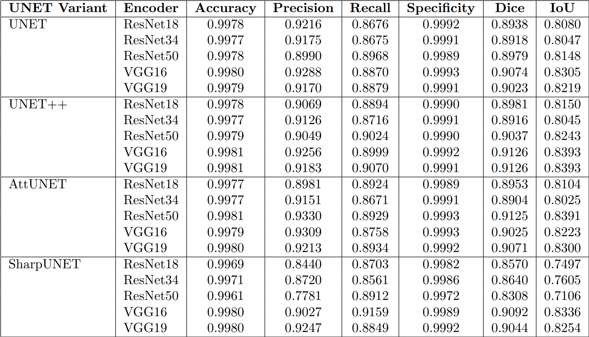

# Exploration of UNet architectures on brain tumor segmentation
This project implements and compares multiple UNet-based architectures (UNet, UNet++, Attention UNet, and Sharp UNet) for brain tumor segmentation using MRI images.  
Performance is evaluated using metrics like Dice, IoU, Precision, and Recall, with experiments conducted across different encoder backbones.

# Dataset

The dataset used is the **Brain Tumor MRI Segmentation** dataset. Make sure the dataset is downloaded and placed appropriately before training or evaluation. The structure and path may need to be adjusted depending on your platform (Kaggle, Colab, or local machine).

 Dataset used: [Kaggle - Brain Tumor MRI Dataset](https://www.kaggle.com/datasets/mateuszbuda/lgg-mri-segmentation)

# setup the project
The code was run on Ubuntu with the following setup:

1. Install Python 3.10.x

2. From the terminal, run the following:

   ```bash
   pip3 install -r requirements.txt
and also code was run on kaggle notebooks for accessing GPUs, so make sure to change the paths for using any file in the code depending on whether you are running the code on your local machine or any cloud services like google colab/kaggle.


# Repo structure
Exploration_of_UNet_architectures_on_brain_tumor_segmentation/
│
├── UNET_Notebooks/                         # Notebooks of Model training and testing of UNET+pretrained encoders
│
├── AttUNET_Notebooks/                         # Notebooks of Model training and testing of AttUNET+pretrained encoders
│
├── UNETPP_Notebooks/                         # Notebooks of Model training and testing of UNETPlusPlus+pretrained encoders
│
├── SharpUNET_Notebooks/                         # Notebooks of Model training and testing of SharpUNET+pretrained encoders
├── Src/models/
   ├── UNET/                                     # codes of UNET+ pretrained encoders
   ├── UNETPP/                                   # codes of UNETPP+pretrained encoders
   ├── AttUNET/                                  # codes of AttUNET+pretrained encoders
   └── SharpUNET/                                # codes of SharpUNET+pretrained encoders


# Results



# References
1. [U-Net: Convolutional Networks for Biomedical Image Segmentation](https://arxiv.org/abs/1505.04597) - O. Ronneberger, P. Fischer, and T. Brox, 2015  
2. [UNet++: A Nested U-Net Architecture for Medical Image Segmentation](https://arxiv.org/abs/1807.10165) - Z. Zhou et al., 2018  
3. [Attention U-Net: Learning Where to Look for the Pancreas](https://arxiv.org/abs/1804.03999) - O. Oktay et al., 2018  
4. [Sharp U-Net: Depthwise Convolutional Network for Biomedical Image Segmentation](https://ieeexplore.ieee.org/document/9765602) - W. Lin et al., 2022  
